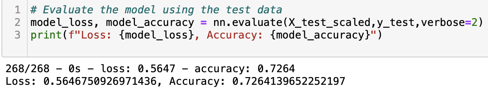
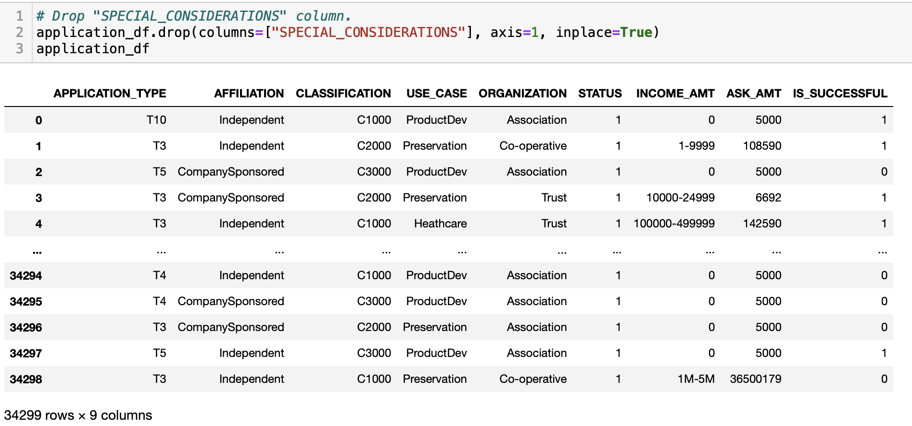
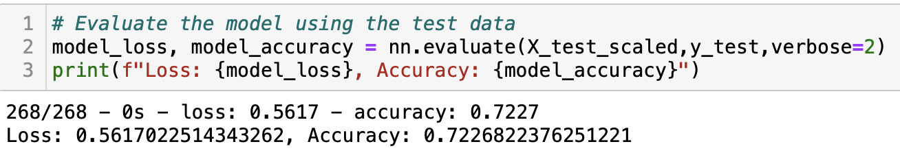
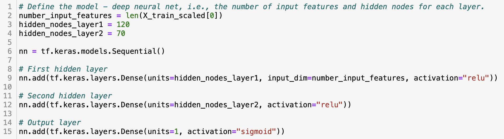
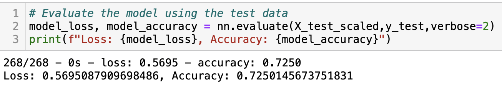
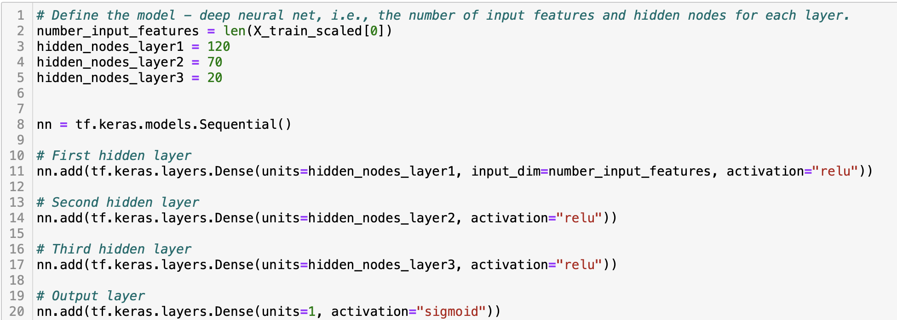
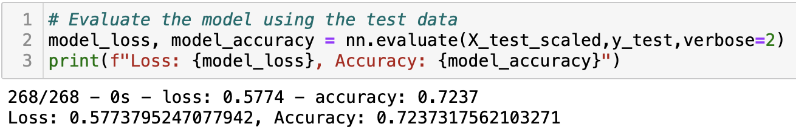
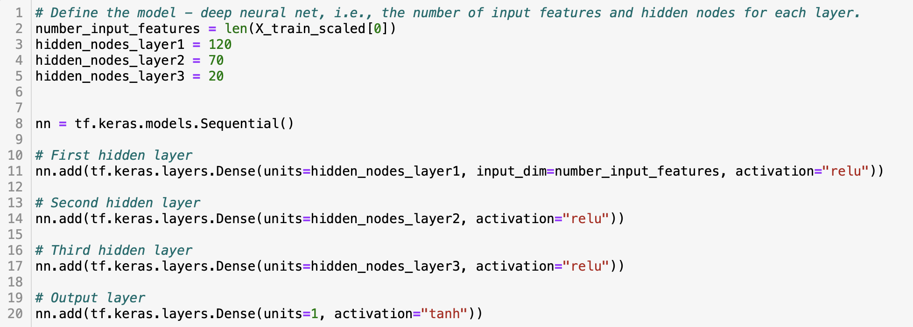
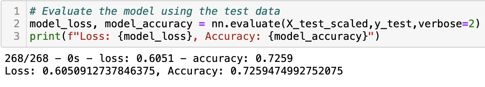

# Neural_Network_Charity_Analysis

## Overview of Project

The purpose of this project is to use knowledge of machine learning and neural networks to create a binary classifier that is capable of predicting whether applicants are going to be successful if funded by Alphabet Soup. Thus, helping Alphabet Soup determine which organizations are worth donating to. As a result of this, we are required to design and train a deep learning neural network using a dataset that contains more than, 34,000 organizations that have recieved funding from Alphabet Soup over the years using the following steps:

- Preprocessing Data for a Neural Network Model
- Compile, Train, and Evaluate the Model
- Optimize the Model

## Results

This section of the report focuses on steps taken for preprocessing the data followed by compiling, training and evaluating the model.

### Data Preprocessing 

The following considerations were taken into account for the preprocessing stage of the dataset:

- The **IS_SUCCESSFUL** column which contains binary data on whether or not the donation money was used effectively is considered as the target for our deep learning neural network model.

- The variables that were considered to be the features of our deep learning neural network model are every other column of the dataset except the **IS_SUCCESSFUL** column that is used as the target of our model and the columns that are dropped.

- The variables that are considered as neither the targets nor features of our deep learning neural network model and were dropped from the input data are the **EIN** and **NAME** which are considered as the identification columns since they have a litle to no impact on the outcome.

### Compiling, Training, and Evaluating the Model

This portion of the project focuses on the results achieved after compiling, training and evaluating the model as described below:

- The deep learning neural network model contains 43 input features, and two hidden layers with 80 and 30 neurons in each layer repectively. Additionally, activation function **RELU** is used for each of the hidden layers to speed up the training process and allow our hidden layers to identify and train on nonlinear relationships in the dataset and activation function of **sigmoid** is used for our binary output classification to allow production of probability output.

- The accuracy of our deep learning neural network model was **73%** which is not a satisfying performance in predicting the outcome of making effective donations as it is under target perfomance of **75%**. The achieved accuracy of our model is illustrated in the figuree below.

To increase the model performance the following attempts were taken:

- Dropping another noisy variable from features which is the **SPECIAL_CONSIDERATIONS** column as shown in the figure below.

- Adding additional neurons to each of the hidden layers as illusrated in the figure below.

- Adding additional hidden layer as depicted in the figure below.

- Changing the activation function of the output layer from **sigmoid** to **tanh** as displayed in the figure blow.

After taking all the aforementioned steps, the accuracy score of our model was achieved to be **73** which is still below the target performance of **75%** as shown below.

## Summary

In conclusion, the deep learning neural network model produced moderate accuracy in predicting whether applicants are going to be successful if funded by Alphabet Soup. However, a predictive accuracy higher than **75%** was never achieved even after making multiple attempts in optimizing the model.

Therefore, it is recommended to take an alternative approach by trying a new supervised machine learning model such as the random forest classifier model which is an ensemble learning model that combines multiple smaller models into a more robust and accurate model. Aditionally, random forest is able to train on the dataset and predict values much faster than neural network while preventing the data from getting ovefitted.

